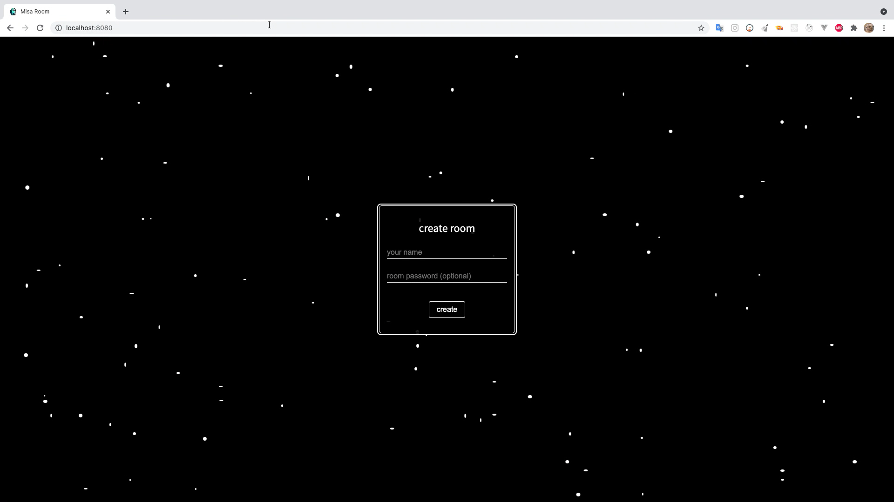
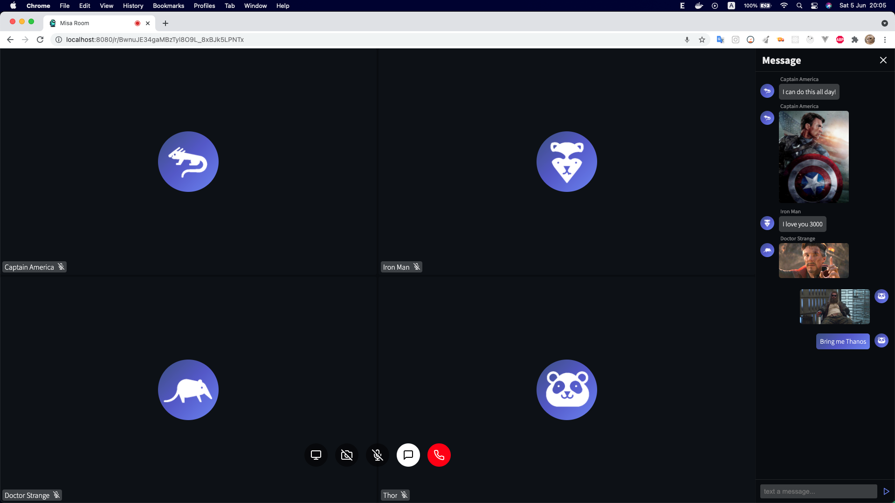
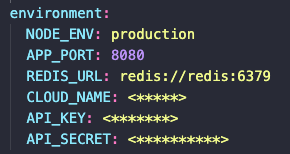

# Misa Room ✨

Real time communication application created with ReactJs, NodeJs, Socket IO and Redis.

## Features

- Create private or public room
- Audio call
- Video call
- Share screen
- Chat (text and image)

  

## Install

<em>

Misa Room uses [Cloudinary](https://cloudinary.com/) to store a temporary photo of a room, the photo will be deleted after the room is finished. You need CLOUD_NAME, API_KEY, API_SECRET of Cloudinary.

</em>

- Fill in the environment variables as shown in the image in the file `docker-compose.yml`.
- Run `docker-compose up --build`.

  

## License

[MIT](https://choosealicense.com/licenses/mit/)
